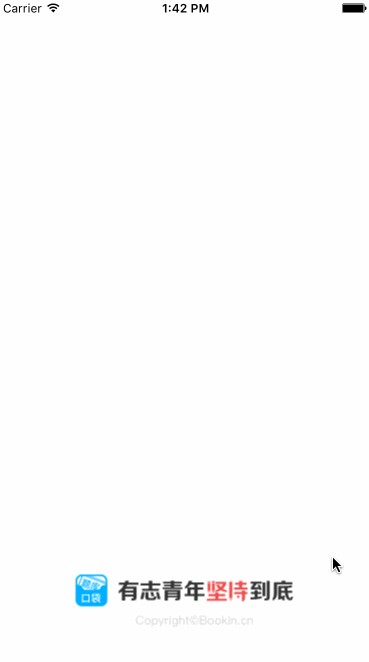

#DGAdLaunchView

==============

##Purpose

DGAdLaunchView 是一个模仿`NetEase New`在app Launch页面时的广告页面效果。

依赖库：

* [SDWebImage](https://github.com/rs/SDWebImage)：管理图片缓存
* [SnapKit](https://github.com/SnapKit/SnapKit)：UI布局
* [DACircularProgress](https://github.com/danielamitay/DACircularProgress)：进度条

##Description

DGAdLaunchView是[口袋题库](https://itunes.apple.com/us/app/kou-dai-ti-ku-kao-yan-kao/id927291424?mt=8)的启动广告页面。

缓存处理逻辑：
以缓存中的图片为准，如果有图片的话使用；没有图片的时候（第一次打开app）直接进入rootvc，然后网络请求下载图片。

##more

* 增加代理方法，自定义点击事件；
* 自定义倒计时按钮样式，目前市面上有两种，我已经做好，近期上传；
* 写单例方法，在appdelegate调用的时候更加方便。
